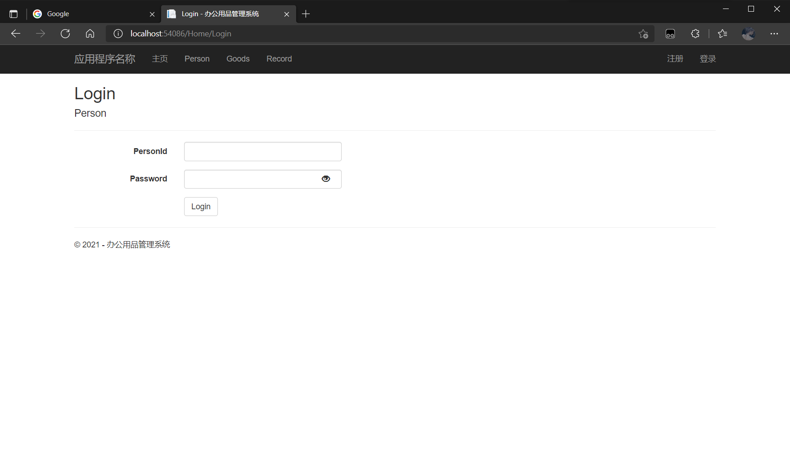
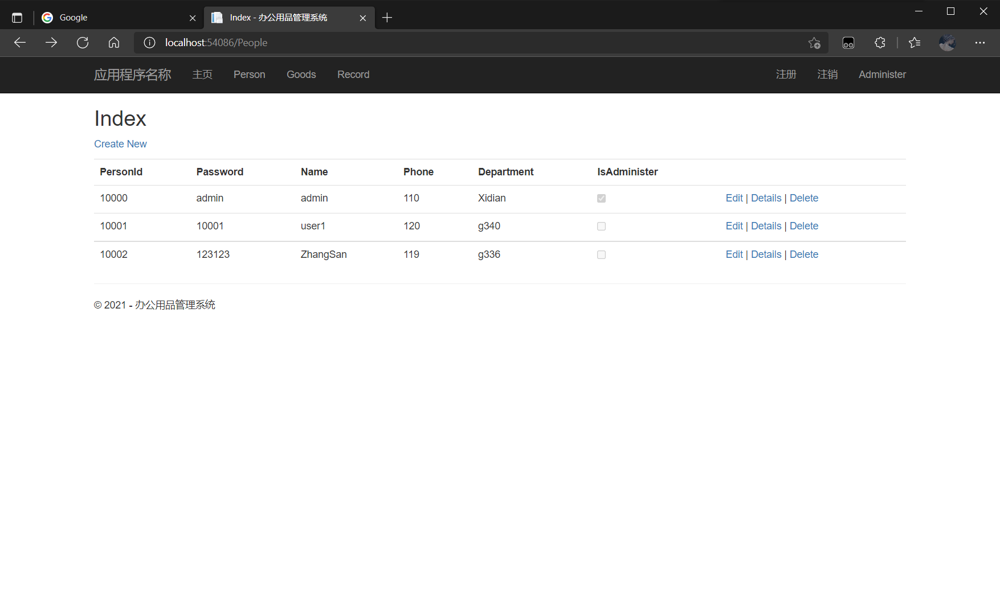
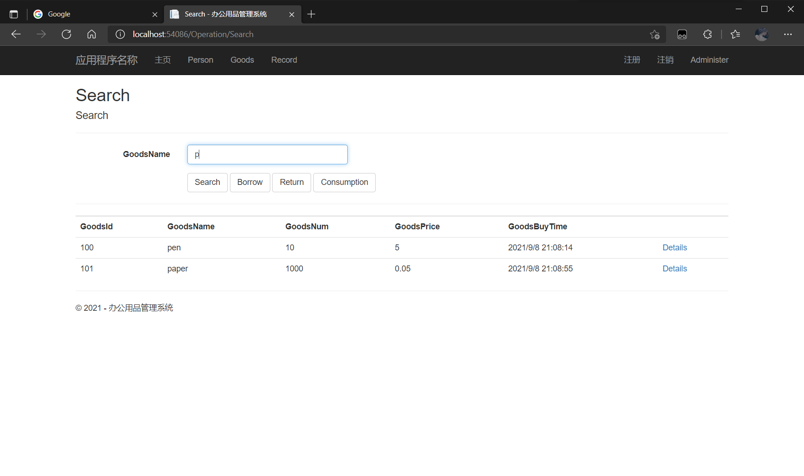
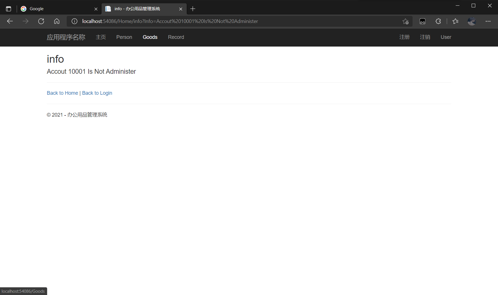

# Management
​	A office supplies management system

#### 系统框架

​	整个系统是基于**ASP.Net Web**开发的Web应用

#### 基本功能

- 账户 ：用户的登录注册、管理员的登录(留有注册的接口测试用)、账户注销、对各个页面和操作的账户访问控制
- 商品（办公用品）：增删改查，管理员对其有全部操作权限，用户仅可查看
- 借还（包括消耗）记录：增删改查，管理员对其有全部操作权限，用户**不可查看**，仅可通过接口进行相应借还操作，包括模糊查找，页面跳转

#### 项目运行截图

#### 项目当前阶段

​	实现了基本的功能

#### 下一阶段的目标

- 为页面添加图片及CSS样式，页面布局优化
- 。。。
